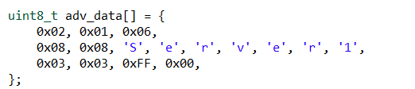
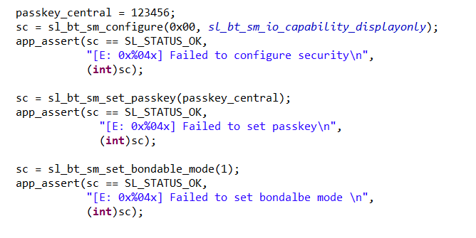
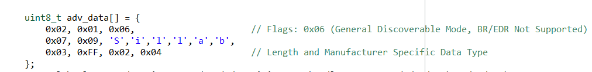

# BLE-Advance
# Description
This project describes the communication between a central BLE device and multiple peripheral BLE devices. The project uses an enhanced security pairing method to ensure secure communication between the central and peripheral devices. The central device is also connected to a smartphone, allowing the smartphone to control the LEDs of the three peripheral devices. through the central.
## Gecko SDK version
GSDK v4.4.0
## Hardware Required
- 4 BGM220P: A central device and 3 peripheral
- A smartphone
## Setup
- You can clone this project.
- You need to check whether the libraries for USART,mbedtls, sleep timer, and log are already included.
- You must check file gatt_configuration.btconf in folder config both peripheral and central. You need to check your service and characteristic.
1. Checking config file btconfig of peripheral device

2. Checking config file btconfig of central device

## Explained ideal of project
1. Connecting process between central and peripherals
- In order to establish a connection between the central and peripheral devices, the peripheral needs to advertise packets, and the central device must perform scanning to discover these packets and initiate a connection request with the peripheral.
- The format of my packet consists of Long, Type, and Data. The first byte will be the size, the second byte will be the type of the packet, and the remaining bytes will contain the data of the packet.

- After connected, central can discover services and discover characteristics.
- If smartphone want to control led peripherals such as turn on, turn of and toggle. It must be connected
to central and write characteristic for central and central will sent a string to peripherals such as "led 1 on"...

2. Pairing and bonding process
- The pairing process between the central device and the peripherals is performed using the Just Works method. For the pairing process between the central device and the smartphone, I use the Passkey Entry method.

- Just works [this results in an unauthenticated but encrypted connection!]

- Passkey Entry (Initiator displays, Responder inputs) [authenticated]

- You can follow this table. In this table, I config central and peripherals are display only. So I use Just work method for pairing process. Your smartphone is a device which can KeyBoard and Display.
So look at the table, we can see the method of pairing process between central and smartphone are Passkey Entry. Moreover, Cetral will display Passkey and smartphone will input this Passkey.

- You can read fully at: https://docs.silabs.com/bluetooth/5.0/bluetooth-general-security/
## How it work
- Firtsly, you need to build folder bootloader for checking update firmware. You must build bootloader for all devices (4 devices).
- After that, build central_bgm_220P folder, central will be started scanning.
- Then, build peripheral_bgm_220P folder, a peripheral will be advertised.
- Then, change your advertised in peripheral_bgm_220P folder, you need replace server in advertise. Such as change "1" -> "2" or "3". And continue Load the code into the device.

- You need turn on terminal of devices for watching the program flow.
- After connecting between peripherals and central. You can use your smartsphone connect to central. I use Si connect because it a application developed by Sillab.
- when you use Si Connect, you must turn on bluetooth and locate location. And Searching your central device. I had use shortenname "Sillab" so i must find this name and connect to it.

- Pres on connect button

- Enter the passkey for bonding success. The pass in central device code.

-  The bonding success full

- Controll led of 3 peripheral, You can enter a string such as "led 1 on", "led 2 off", "led 3 toggle"...

## Special Notes
- For sure, you load bootloader firtsly after load main code.
- If you don't want to use bootloader, you must remove it, you can find it at readme in two folders project.
- This project is not complete. I want to central can update advertise when the led status change.
